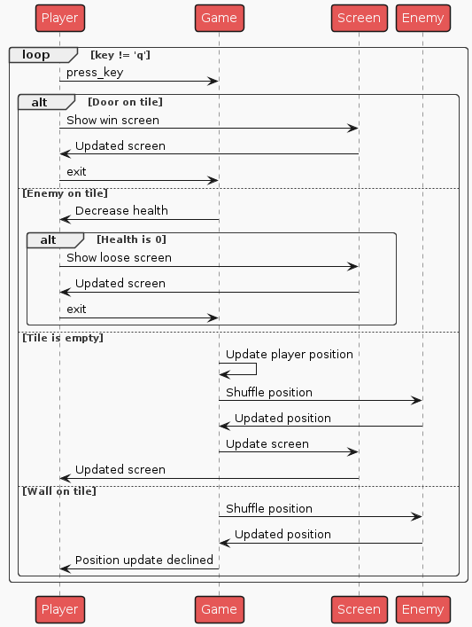

# Поведенческие модели

## Столкновение с врагом
1. Пользователь переместился на новую позицию:

    1.1. На новой позиции есть враг:

    1.1.1. Переместить врага на прошлую позицию игрока

    1.1.2. Снизить здоровье игрока

2. Конец

[File](./diagrams_raw/state_0.plantuml) 

## Перемещение по карте
1. Пользователь нажимает клавишу стрелки (Вверх, Вниз, Вправо или Влево)
    
    1.1. Если клавиша не стрелка - конец 

2. Обновляется позиция игрока:

    2.1. Если на новой позиции нет стены - переместить игрока

    2.2. Если на новой есть стена - не перемещать игрока

3. Отрисовка карты

 

[File](./diagrams_raw/state_1.plantuml) 

## Вход в дверь
1. Пользователь переместился на новую позицию:

    1.1. На новой позиции есть дверь:

    1.1.1. Показать экран победы

    1.1.2. Выйти из игры

2. Конец

[File](./diagrams_raw/state_2.plantuml) 

## Взаимодействие с картой

1. Пользователь нажимает клавишу стрелки (Вверх, Вниз, Вправо или Влево)
    
    1.1. Если клавиша не стрелка - конец 

2. Обновляется позиция игрока:

    2.1. Если на новой позиции нет стены - переместить игрока

    2.2. Если на новой есть стена - не перемещать игрока

    2.3. На новой позиции есть враг:

        2.3.1. Переместить врага на прошлую позицию игрока

        2.3.2. Снизить здоровье игрока
        
        2.3.3. Здоровье = 0

            2.3.3.1. Показать экран проигрыша

            2.3.3.2. Выйти из игры

    2.4. На новой позиции есть дверь:

        2.4.1. Показать экран победы

        2.4.2. Выйти из игры

3. Отрисовка карты

 

[File](./diagrams_raw/sequence.plantuml) 
