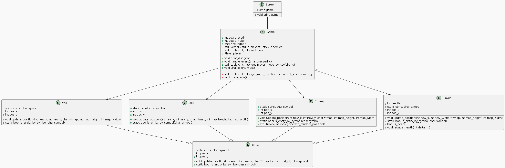
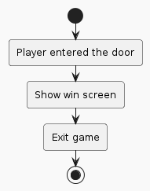

# Структурные модели

## Структуры(Классы)
### Описание:

Класс Entity описывает сущности, размещаемые на карте
Классы Door, Wall, Enemy, Player являются реализациями основных сущностей игры.
Класс Game реализует основную логику игры
Класс Screen

 

[File](./diagrams_raw/class.plantuml) 

## Объекты
### Описание:

 

[File](./diagrams_raw/activity_4.plantuml) 
